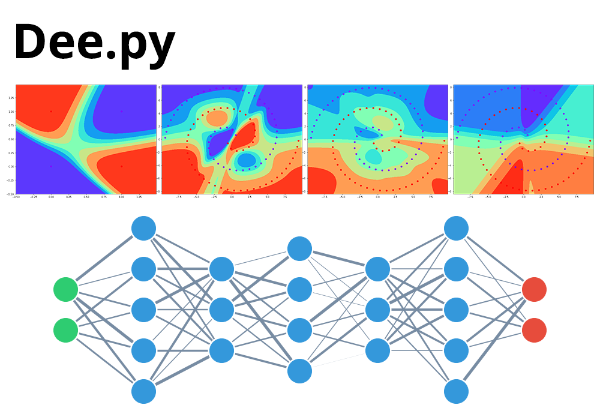

# Dee.py

## A bare-metal deep neural network library for fun learning and experimentation

<p align="center">
  
</p>

## So what does it do?

This library allows you to make and train neural networks with any number of layers and neurons pretty easily:

```py
# Make a network of three hidden layers with 5,3,4,3,5 neurons and 2 output layers
network = Dee([5, 3, 4, 3, 5], 2)

# train the network with X (input) y (output) and custom parameters
network.train(X, y, epochs=1000, learningRate=0.01, batchSize=20)
```

## Purpose

This library was designed for learning and experimentation. The source is almost 200 lines of core code. And you can dig deep, tune parameters, apply custom functions, and visualize the result in no time. There are production-ready deep learning frameworks available such as Theano, Keras, and Tensorflow, but their implementation is pretty complicated and certainly not for the jumpstarters.

## XOR Example

```py
from dee import Dee

# input data
X = [
	[0, 0],
	[0, 1],
	[1, 0],
	[1, 1],	 
]

# output truth
y = [0, 1, 1, 0]

# training the network with two hidden layers of 3 neurons, and 2 output layers
# play with the network and see how the plot changes
network = Dee([3, 3], 2)
network.train(X, y, epochs=1000, learningRate=0.01, batchSize=20)

# visualize everything
network.visualize()
network.plot2D()
network.plotLoss()
```

## Fun Exercises

- Modify the code to use sigmoid or relu instead of tanh
- Experiment with single batch or single row (stochastic gradient descent)
- Add regularization to reduce overfitting
- Optimize the spiral problem to gain a better visual result
- Try a dataset with multiple classes
- Make the loss graph update in realtime
- Use CudaMat to GPUfy the training and save time
- Apply an advanced optimization function, such as adam (fun is subjective for this one ;)

## Stay In Touch

For latest releases and announcements, check out my site: [aliashraf.net](http://aliashraf.net)

## License

This software is released under the [MIT License](LICENSE). Please read LICENSE for information on the
software availability and distribution.

Copyright (c) 2018 [Ali Ashraf](http://aliashraf.net)